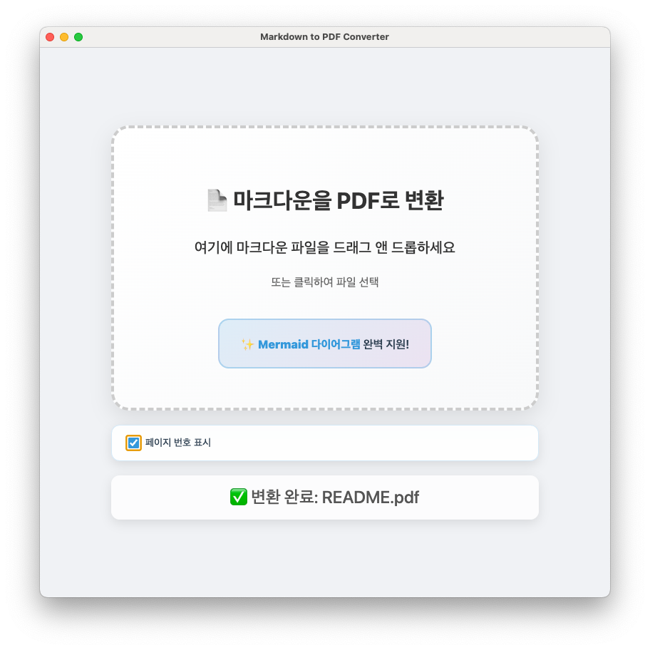

# 📄 Markdown to PDF Converter

**Mermaid 다이어그램을 완벽 지원하는 마크다운 PDF 변환기**


## ✨ 주요 기능

- 🚀 **빠른 변환**: Puppeteer 기반의 고성능 PDF 생성 엔진
- 📊 **Mermaid 다이어그램 지원**: 플로우차트, 시퀀스 다이어그램, 간트 차트 등 완벽 지원
- 🎨 **아름다운 스타일링**: 전문적인 PDF 레이아웃과 타이포그래피
- 🖱️ **직관적인 UI**: 드래그 앤 드롭으로 간편한 파일 변환
- 🔧 **크로스 플랫폼**: Windows, macOS, Linux 지원
- 📁 **자동 폴더 열기**: 변환 완료 후 결과 파일 위치 자동 표시

## 🖼️ 스크린샷

### 메인 인터페이스


### 변환 결과 예시



## 📦 설치 방법

### Windows

1. [Releases](../../releases) 페이지에서 최신 버전 다운로드
2. `Markdown to PDF Converter Setup 1.0.0.exe` 실행하여 설치
3. 또는 `Markdown to PDF Converter 1.0.0.exe` 포터블 버전 사용

### macOS

1. [Releases](../../releases) 페이지에서 `.dmg` 파일 다운로드
2. DMG 파일을 열고 애플리케이션을 Applications 폴더로 드래그

### Linux

1. [Releases](../../releases) 페이지에서 `.AppImage` 파일 다운로드
2. 실행 권한 부여: `chmod +x Markdown-to-PDF-Converter-1.0.0.AppImage`
3. 파일 실행

## 🚀 사용 방법

### 1. 파일 선택

- **드래그 앤 드롭**: 마크다운 파일을 애플리케이션 창에 드래그
- **클릭 선택**: 드롭 존을 클릭하여 파일 선택 대화상자 열기

### 2. 자동 변환

- 파일 선택 시 자동으로 변환 시작
- 실시간 진행 상황 표시
- Mermaid 다이어그램 자동 렌더링

### 3. 결과 확인

- 변환 완료 시 자동으로 결과 폴더 열기
- `output` 폴더에 PDF 파일 생성

## 📝 지원하는 마크다운 문법

### 기본 문법

- **헤더**: `# ## ###`
- **강조**: `**굵게**`, `*기울임*`
- **코드**: `` `인라인 코드` ``
- **링크**: `[텍스트](URL)`
- **리스트**: `- 항목`

### Mermaid 다이어그램

```markdown
graph LR
    A[시작] --> B{조건}
    B -->|예| C[작업 1]
    B -->|아니오| D[작업 2]
    C --> E[끝]
    D --> E
```

#### 지원하는 다이어그램 유형
- **플로우차트**: `graph`, `flowchart`
- **시퀀스 다이어그램**: `sequenceDiagram`
- **클래스 다이어그램**: `classDiagram`
- **상태 다이어그램**: `stateDiagram`
- **간트 차트**: `gantt`
- **파이 차트**: `pie`
- **사용자 여정**: `journey`
- **Git 그래프**: `gitgraph`

## 🛠️ 개발자 정보

### 기술 스택
- **프레임워크**: Electron 37.2.6
- **PDF 엔진**: Puppeteer 24.16.1
- **다이어그램**: Mermaid 11.9.0
- **언어**: Node.js, HTML, CSS, JavaScript

### 프로젝트 구조

```tree
md-to-pdf/
├── main.js # Electron 메인 프로세스
├── index.html # UI 인터페이스
├── renderer.js # 렌더러 프로세스
├── preload.js # 보안 컨텍스트 브리지
├── convert-md-to-pdf.js # PDF 변환 엔진
├── pdf-styles.css # PDF 스타일시트
├── assets/ # 아이콘 및 리소스
└── package.json # 프로젝트 설정
```

### 로컬 개발 환경 설정

#### 1. 저장소 클론
```bash
git clone https://github.com/dandycode/md-to-pdf.git
cd md-to-pdf
```

#### 2. 의존성 설치

```bash
npm install
```

#### 3. 개발 모드 실행

```bash
npm start
```

#### 4. 빌드

```bash
# 모든 플랫폼용 빌드
npm run dist

# Windows만 빌드
npm run dist -- --win

# macOS만 빌드
npm run dist -- --mac

# Linux만 빌드
npm run dist -- --linux
```

## 🔧 설정 옵션

### PDF 출력 설정

- **페이지 크기**: A4
- **여백**: 20mm (상하좌우)
- **폰트**: 시스템 기본 폰트 (Malgun Gothic 포함)
- **배경**: 인쇄 시 배경색 포함

### Mermaid 설정

- **테마**: Default
- **보안 레벨**: Loose (모든 기능 활성화)
- **폰트**: Arial, sans-serif
- **타임아웃**: 20초

## 🐛 문제 해결

### 자주 발생하는 문제

#### Q: 드래그 앤 드롭이 작동하지 않아요

**A**: 다음을 확인해보세요:

- 마크다운 파일(.md, .markdown)인지 확인
- 파일이 다른 프로그램에서 열려있지 않은지 확인
- 관리자 권한으로 실행해보기

#### Q: Mermaid 다이어그램이 표시되지 않아요

**A**: 다음을 시도해보세요:

- 인터넷 연결 확인 (Mermaid 라이브러리 로드 필요)
- 다이어그램 문법이 올바른지 확인
- 방화벽이 차단하고 있지 않은지 확인

#### Q: PDF 생성이 너무 오래 걸려요

**A**: 다음 사항을 확인해보세요:

- 파일 크기가 너무 크지 않은지 확인
- 다이어그램 개수가 많지 않은지 확인
- 시스템 리소스 여유 확인

#### Q: 한글이 깨져서 나와요

**A**: 시스템에 한글 폰트가 설치되어 있는지 확인하세요. Windows의 경우 Malgun Gothic이 기본으로 사용됩니다.

## 📄 라이선스

이 프로젝트는 MIT 라이선스 하에 배포됩니다. 자세한 내용은 [LICENSE](LICENSE) 파일을 참조하세요.

## 🤝 기여하기

프로젝트에 기여하고 싶으시다면:

1. 저장소를 포크합니다
2. 새로운 기능 브랜치를 생성합니다 (`git checkout -b feature/amazing-feature`)
3. 변경사항을 커밋합니다 (`git commit -m 'Add some amazing feature'`)
4. 브랜치에 푸시합니다 (`git push origin feature/amazing-feature`)
5. Pull Request를 생성합니다

## 📞 지원 및 문의

- **이슈 리포트**: [GitHub Issues](../../issues)
- **기능 요청**: [GitHub Discussions](../../discussions)
- **이메일**: dandycode@gmail.com

## 🙏 감사의 말

이 프로젝트는 다음 오픈소스 프로젝트들의 도움을 받았습니다:

- [Electron](https://electronjs.org/) - 크로스 플랫폼 데스크톱 앱 프레임워크
- [Puppeteer](https://pptr.dev/) - 헤드리스 Chrome API
- [Mermaid](https://mermaid.js.org/) - 다이어그램 및 차트 생성 라이브러리
- [electron-builder](https://www.electron.build/) - 멀티 플랫폼 빌드 도구

---

**⭐ 이 프로젝트가 유용하다면 스타를 눌러주세요!**
